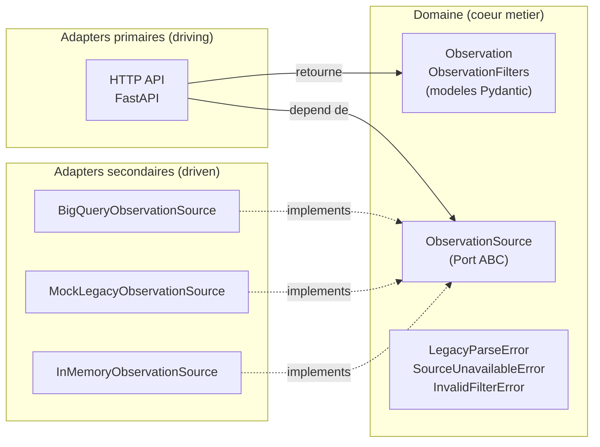
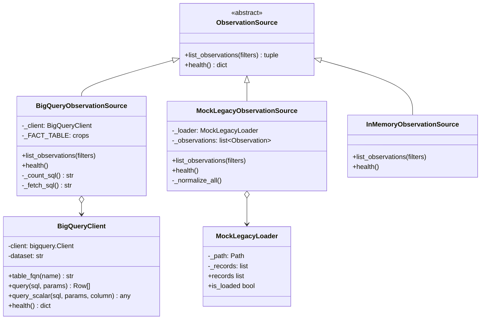

# Architecture

Ce document presente l'architecture globale du projet : pattern hexagonal, sources interchangeables, et regle de dependance.

Pour le detail du contrat expose, voir [02-api-contract.MD](./02-api-contract.MD). Pour l'implementation BigQuery, voir [03-bigquery.MD](./03-bigquery.MD).

## Vue d'ensemble : Hexagonal Architecture (Ports & Adapters)

Le projet suit l'architecture hexagonale (Alistair Cockburn). Le coeur metier (modeles Pydantic) est au centre, completement agnostique de toute technologie. Les technologies (HTTP, BigQuery, JSON files) sont des adapters branches sur des ports definis par le domaine.



**Regle de dependance** : toutes les fleches pointent vers le centre. Le domaine ne sait rien des adapters ; les adapters connaissent le domaine.

## Structure des dossiers

```
app/
  __init__.py
  main.py                       Point d'entree FastAPI, middleware, handlers
  config.py                     Settings env-only (SourceKind, GCP_PROJECT, ...)
  exceptions.py                 Exceptions domaine
  logging_config.py             Configuration structlog JSON
  middleware.py                 CorrelationIdMiddleware
  api/
    observations.py             Routes /observations
    error_handlers.py           Handlers FastAPI -> ApiResponse[None]
  domain/
    models.py                   Observation, ObservationFilters
    response.py                 ApiResponse[T], Pagination, ErrorDetail
  sources/
    base.py                     ObservationSource ABC (port)
    factory.py                  get_source(settings) -> implementation
    in_memory_source.py
    bigquery/
      __init__.py
      client.py                 BigQueryClient (gateway generique)
      observation_source.py     BigQueryObservationSource (repository)
      mapping.py                row_to_observation
    mock_legacy/
      __init__.py
      loader.py                 MockLegacyLoader
      source.py                 MockLegacyObservationSource
      mapping.py                legacy_to_observation
sql/
  ddl_demo.sql                  Table hypothetique partitionnee + clusterisee
  analytics_query.sql           Query optimisee avec justification de scan
data/
  mock_legacy_fixtures.json     Fixtures format etranger pour MockLegacy
```

## Diagramme de classes des sources

Toutes les sources implementent le meme port `ObservationSource`. BigQuery et MockLegacy s'appuient sur un objet d'infrastructure dedie (client SDK, loader fichier).



## Configuration vs topologie

Decision structurante : separation entre les parametres d'environnement et la topologie metier.

| Aspect       | Question repondue                      | Ou ca vit                       | Exemples                            |
| ------------ | -------------------------------------- | ------------------------------- | ----------------------------------- |
| Configuration| "Ou je me connecte ? Avec quoi ?"      | `app/config.py` (env vars)      | Projet GCP, dataset, credentials    |
| Topologie    | "Quelles tables ? Comment je requete ?"| Code des adapters               | Nom des tables, JOINs, SQL          |

La config ne contient pas de nom de table ni de SQL. La topologie vit dans le code de chaque source (par exemple `_FACT_TABLE = "crops"` dans `BigQueryObservationSource`). Cette separation reflete la pratique ORM/Repository standard et anticipe le cas de production ou un client a typiquement plusieurs tables (fact + dimensions).

## Switch de source

Le choix de la source active est pilote uniquement par la variable d'environnement `SOURCE_KIND`. Aucune ligne de code a modifier pour basculer entre sources.

| SOURCE_KIND  | Implementation                                                      |
| ------------ | ------------------------------------------------------------------- |
| `in_memory`  | `InMemoryObservationSource()` (5 records hardcodes, aucun credential)|
| `bigquery`   | `BigQueryObservationSource(BigQueryClient(settings))`               |
| `mock_legacy`| `MockLegacyObservationSource(settings)` (fixtures JSON format etranger)|

Cette pilotabilite est la preuve que l'adapter pattern est en place : la route HTTP utilise une dependance `ObservationSource` typee, resolue par la factory selon la config.

## Pour aller plus loin

- Detail du contrat de reponse et des codes d'erreur : [02-api-contract.MD](./02-api-contract.MD)
- Detail de l'adapter BigQuery (Gateway + Repository, optimisation scan) : [03-bigquery.MD](./03-bigquery.MD)
- Guide pour brancher une nouvelle source : [04-add-source.MD](./04-add-source.MD)
