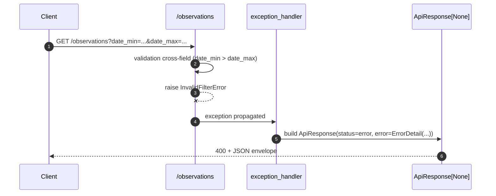

# Contrat API

Ce document decrit le contrat HTTP expose par l'API : endpoints, structure de reponse, gestion des erreurs, et observabilite. Le contrat est stable independamment de la source backend active (voir [01-architecture.md](./01-architecture.md)).

## Endpoints disponibles

| Methode | Chemin           | Description                                                       | Tags          |
| ------- | ---------------- | ----------------------------------------------------------------- | ------------- |
| GET     | `/observations`  | Liste paginee des observations selon les filtres fournis          | observations  |
| GET     | `/healthz`       | Probe de sante applicative + connectivite de la source active     | health        |
| GET     | `/`              | Metadonnees de navigation (nom, version, liens vers docs/health)  | hors schema   |
| GET     | `/docs`          | Swagger UI (auto-genere par FastAPI)                              | -             |
| GET     | `/openapi.json`  | Schema OpenAPI 3 (auto-genere par FastAPI)                        | -             |

## Envelope `ApiResponse[T]`

Toutes les routes retournent la meme enveloppe, quelle que soit la nature du payload (objet, tableau, ou erreur). Le client peut donc parser uniformement.

```json
{
  "status": "success | error",
  "message": "string",
  "data": "T | null",
  "size": "int | null",
  "pagination": {
    "page": "int",
    "limit": "int",
    "total_items": "int | null",
    "total_pages": "int | null",
    "has_next": "bool"
  },
  "error": {
    "code": "string (ErrorCode)",
    "message": "string",
    "details": "object | null"
  }
}
```

Regles :

- `status` : `"success"` quand la requete a abouti, `"error"` sinon.
- `data` : payload typique de la ressource ; `null` en cas d'erreur.
- `size` : longueur de `data` si tableau, `null` sinon.
- `pagination` : present uniquement quand la ressource est paginee (`/observations`).
- `error` : `null` quand `status="success"`, populated quand `status="error"`.

## Exemple : reponse succes paginee

```bash
curl "http://localhost:8000/observations?essai_id=IA&limit=2&date_min=2022-01-01&date_max=2022-12-31"
```

```json
{
  "status": "success",
  "message": "Observations retrieved successfully.",
  "data": [
    {
      "essai_id": "IA",
      "parcelle_id": "LINN",
      "date_observation": "2022-12-31",
      "mesure_valeur": 215.4,
      "mesure_type": "CORN_YIELD"
    },
    {
      "essai_id": "IA",
      "parcelle_id": "POLK",
      "date_observation": "2022-12-31",
      "mesure_valeur": 185.2,
      "mesure_type": "CORN_YIELD"
    }
  ],
  "size": 2,
  "pagination": {
    "page": 1,
    "limit": 2,
    "total_items": 1158,
    "total_pages": 579,
    "has_next": true
  },
  "error": null
}
```

## Pagination

Pagination offset-based : `limit` (taille de page) + `offset` (nombre d'elements a sauter).

| Parametre      | Type | Default | Plage      | Description                                                                |
| -------------- | ---- | ------- | ---------- | -------------------------------------------------------------------------- |
| `limit`        | int  | 100     | 1..1000    | Nombre maximum d'observations par page                                     |
| `offset`       | int  | 0       | >= 0       | Decalage (page 2 avec limit 100 -> offset=100)                             |
| `include_total`| bool | true    | -          | Si false, l'API skip la query COUNT pour reduire le cout cote backend      |

### Mode skip-count (`include_total=false`)

Cas d'usage : scroll infini, frontend qui ne montre pas "page X / Y". L'API economise la query COUNT cote backend (~700 MB scannes sur USDA non partitionnee, voir [03-bigquery.md](./03-bigquery.md)).

```bash
curl "http://localhost:8000/observations?essai_id=IA&limit=2&include_total=false"
```

```json
{
  "status": "success",
  "message": "Observations retrieved successfully.",
  "data": [ ... ],
  "size": 2,
  "pagination": {
    "page": 1,
    "limit": 2,
    "total_items": null,
    "total_pages": null,
    "has_next": true
  },
  "error": null
}
```

`has_next` reste calculable sans COUNT, base sur la taille de la page retournee.

## Filtres disponibles sur `/observations`

| Parametre      | Type   | Default | Description                                                          |
| -------------- | ------ | ------- | -------------------------------------------------------------------- |
| `essai_id`     | string | -       | Filtre exact (ex: `IA`, `TX`). 1..10 caracteres                      |
| `date_min`     | date   | -       | Date minimum incluse (ISO `YYYY-MM-DD`)                              |
| `date_max`     | date   | -       | Date maximum incluse (ISO `YYYY-MM-DD`)                              |
| `limit`        | int    | 100     | Voir Pagination                                                      |
| `offset`       | int    | 0       | Voir Pagination                                                      |
| `include_total`| bool   | true    | Voir Pagination                                                      |

Validation cross-field : `date_min` doit etre <= `date_max`. Sinon `400 INVALID_FILTER`.

## Codes d'erreur (ErrorCode)

Liste ouverte, exposee comme `code` machine pour permettre au client de brancher de la logique.

| ErrorCode               | HTTP | Cas d'usage                                                                |
| ----------------------- | ---- | -------------------------------------------------------------------------- |
| `INVALID_FILTER`        | 400  | `date_min > date_max`                                                      |
| `INVALID_FILTER`        | 422  | Validation Pydantic structurelle echouee (`limit=5000`, date invalide...)  |
| `SOURCE_UNAVAILABLE`    | 503  | La source backend est indisponible (timeout BQ, fixtures manquantes...)    |
| `NOT_FOUND`             | 404  | Ressource inexistante                                                      |
| `INTERNAL_ERROR`        | 500  | Erreur inattendue, y compris parsing legacy invalide                       |
| `MISSING_VALUE`         | 400  | Champ requis manquant                                                      |
| `INVALID_DATE_RANGE`    | 400  | Reserve pour usages metier specifiques                                     |

## Exemple : reponse d'erreur

```bash
curl "http://localhost:8000/observations?date_min=2022-12-31&date_max=2022-01-01"
```

```json
{
  "status": "error",
  "message": "date_min (2022-12-31) must be earlier than or equal to date_max (2022-01-01)",
  "data": null,
  "size": null,
  "pagination": null,
  "error": {
    "code": "INVALID_FILTER",
    "message": "date_min (2022-12-31) must be earlier than or equal to date_max (2022-01-01)",
    "details": null
  }
}
```

Code HTTP retourne : `400 Bad Request`.

## Exemple : erreur de validation Pydantic

```bash
curl "http://localhost:8000/observations?limit=5000"
```

```json
{
  "status": "error",
  "message": "Request validation failed.",
  "data": null,
  "size": null,
  "pagination": null,
  "error": {
    "code": "INVALID_FILTER",
    "message": "Request validation failed.",
    "details": {
      "errors": [
        {
          "type": "less_than_equal",
          "loc": ["query", "limit"],
          "msg": "Input should be less than or equal to 1000",
          "input": "5000"
        }
      ]
    }
  }
}
```

Code HTTP retourne : `422 Unprocessable Entity`.

## Exception handlers

Tous les handlers vivent dans `app/api/error_handlers.py` et sont enregistres par `register_exception_handlers(app)` dans `app/main.py`.



Mapping exception -> handler :

| Exception                         | Handler                       | Reponse HTTP |
| --------------------------------- | ----------------------------- | ------------ |
| `InvalidFilterError`              | `invalid_filter_handler`      | 400          |
| `SourceUnavailableError`          | `source_unavailable_handler`  | 503          |
| `LegacyParseError`                | `legacy_parse_handler`        | 500          |
| `RequestValidationError` (FastAPI)| `request_validation_handler`  | 422          |
| `Exception` (catch-all)           | `unhandled_exception_handler` | 500          |

Toutes les reponses d'erreur partagent la meme enveloppe `ApiResponse[None]` que les reponses de succes : la stabilite du contrat s'etend aux erreurs.

## Healthcheck source-aware

```bash
curl "http://localhost:8000/healthz"
```

```json
{
  "status": "success",
  "message": "Service is healthy.",
  "data": {
    "version": "0.1.0",
    "source": {
      "source": "bigquery",
      "ok": true,
      "dataset": "bigquery-public-data.usda_nass_agriculture",
      "table": "crops"
    }
  },
  "size": null,
  "pagination": null,
  "error": null
}
```

`/healthz` appelle `source.health()` sur la source active. Si la source repond `ok=false` (BigQuery injoignable, fixtures manquantes), le `status` global passe a `"error"`. Pratique pour les probes Kubernetes liveness/readiness.

## Observabilite

Trois leviers en place pour la production.

### Logs structures JSON (structlog)

Tous les logs (uvicorn, FastAPI, code applicatif) sont serialises en JSON sur stdout, prets pour ingestion directe par Cloud Logging, Datadog ou ELK sans parsing supplementaire.

Exemple d'entree de log :

```json
{
  "timestamp": "2026-06-08T07:32:15.123Z",
  "level": "info",
  "event": "Observations retrieved",
  "correlation_id": "a1b2c3d4-e5f6-7890-abcd-ef1234567890",
  "method": "GET",
  "path": "/observations",
  "essai_id": "IA",
  "rows_returned": 5
}
```

Configuration : `app/logging_config.py`.

### Correlation ID per request

Le middleware `CorrelationIdMiddleware` (`app/middleware.py`) genere un UUID v4 pour chaque requete (ou honore le header `X-Correlation-Id` fourni par le client). L'ID est :

- Lie au contexte structlog : apparait automatiquement dans tous les logs de la requete
- Renvoye dans le header de reponse `X-Correlation-Id` pour tracabilite bout-en-bout
- Permet de suivre une requete a travers les logs applicatifs et le backend

```bash
curl -i -H "X-Correlation-Id: my-trace-123" "http://localhost:8000/observations"
# Response headers contiennent: X-Correlation-Id: my-trace-123
```

### Healthcheck source-aware

`/healthz` interroge la source active a chaque appel. Permet aux orchestrateurs (Kubernetes, GCP Load Balancer) de detecter une indisponibilite backend et de retirer l'instance du pool.

## Pour aller plus loin

- Architecture globale et regle de dependance : [01-architecture.md](./01-architecture.md)
- Implementation BigQuery (Gateway + Repository, optimisation scan) : [03-bigquery.md](./03-bigquery.md)
- Ajouter une nouvelle source : [04-add-source.md](./04-add-source.md)
