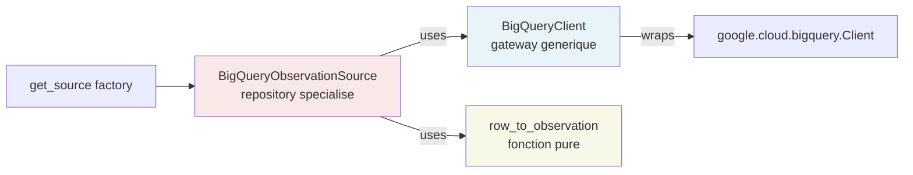
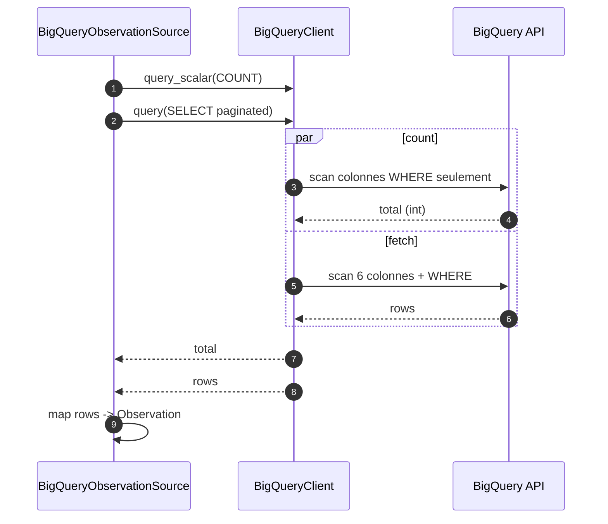

# Source BigQuery

Ce document detaille l'implementation de l'adapter BigQuery : pattern Gateway + Repository, mapping vers le contrat domaine, et optimisation du scan.

Pour le pattern hexagonal global, voir [01-architecture.md](./01-architecture.md). Pour le contrat de reponse, voir [02-api-contract.md](./02-api-contract.md).

## Pattern Gateway + Repository

Dans le sous-package `app/sources/bigquery/`, on applique un second niveau de decoupage analogue au pattern SQLAlchemy (Session + Repository) :



| Composant                       | Role                                                                    | Connait                          |
| ------------------------------- | ----------------------------------------------------------------------- | -------------------------------- |
| `BigQueryClient`                | Gateway generique : auth, exec query, dataset                           | `google.cloud.bigquery`, Settings|
| `BigQueryObservationSource`     | Repository specialise : topologie (`crops`), SQL, orchestration         | Le client + le mapping           |
| `row_to_observation`            | Mapping pur : ligne BQ -> Observation Pydantic                          | Modeles domaine uniquement       |

Avantage de cette separation : si demain on ajoute un `BigQueryEssaiSource` (pour la ressource Essai) ou un `BigQueryParcelleSource`, ils partagent le meme `BigQueryClient` sans duplication du code d'auth ou de gestion de query.

## BigQueryClient (gateway)

Localisation : `app/sources/bigquery/client.py`.

Wrapper async sur `google.cloud.bigquery.Client`. Le SDK officiel est synchrone : on utilise `asyncio.to_thread` pour ne pas bloquer l'event loop FastAPI.

Primitives exposees :

| Methode                                | Description                                                          |
| -------------------------------------- | -------------------------------------------------------------------- |
| `dataset` (property)                   | Dataset FQN configure (ex: `bigquery-public-data.usda_nass_agriculture`)|
| `table_fqn(name)`                      | Construit le FQN backtique d'une table : `` `<dataset>.<table>` ``    |
| `query(sql, params)`                   | Execute une query parametree, retourne la liste de Row                |
| `query_scalar(sql, params, column)`    | Execute une query et retourne le scalaire 1ere ligne / 1ere colonne   |
| `health()`                             | Probe generique (`SELECT 1`) avec dataset dans la reponse             |

Auth : `Application Default Credentials` via `gcloud auth application-default login`. Aucun service account JSON dans le repo.

Parametres typages BigQuery : utilisation systematique de `ScalarQueryParameter` pour passer les filtres. Previent les injections SQL et permet a BQ d'optimiser le plan d'execution.

## BigQueryObservationSource (repository)

Localisation : `app/sources/bigquery/observation_source.py`.

Implementation du port `ObservationSource` (cf. `app/sources/base.py`).

Topologie encodee dans la classe :

```python
class BigQueryObservationSource(ObservationSource):
    _FACT_TABLE = "crops"

    def __init__(self, client: BigQueryClient) -> None:
        self._client = client
```

Le nom de la table n'est pas dans la config (env vars) mais dans le code : c'est une decision metier, pas environnementale. Pour le detail de cette separation, voir [01-architecture.md](./01-architecture.md).

## Mapping ligne BQ -> Observation

Mapping declare dans la query SQL via des alias correspondant aux champs du contrat :

| Colonne BQ                                         | Alias SQL          | Champ Observation     |
| -------------------------------------------------- | ------------------ | --------------------- |
| `state_alpha`                                      | `essai_id`         | `essai_id`            |
| `county_name`                                      | `parcelle_id`      | `parcelle_id`         |
| `DATE(year, 12, 31)`                                | `date_observation` | `date_observation`    |
| `value`                                            | `mesure_valeur`    | `mesure_valeur`       |
| `CONCAT(commodity_desc, '_', statisticcat_desc)`   | `mesure_type`      | `mesure_type`         |

La fonction `row_to_observation` (`app/sources/bigquery/mapping.py`) est pure : elle lit la Row BQ par cle et construit l'Observation. Testable unitairement sans aucun mock du SDK BigQuery.

Note metier : ce mapping est arbitraire (etat -> essai, comte -> parcelle, fin d'annee -> date). Dans une vraie installation chez Bayer Crop Science, le schema natif aurait probablement `fact_observations` + `dim_essais` + `dim_parcelles` avec des JOINs. L'adapter pattern absorbe ce changement sans toucher au contrat expose ni a la route HTTP.

## Optimisation du scan BigQuery

La table publique `bigquery-public-data.usda_nass_agriculture.crops` n'est pas partitionnee ni clusterisee (limite des datasets publics maintenus par BigQuery). Trois leviers actionnes pour minimiser le scan :

### Levier 1 : SELECT colonnaire cible

BigQuery est un moteur columnar storage : il facture par colonnes lues, pas par lignes. La query principale ne selectionne que 6 colonnes sur 41.

```sql
SELECT state_alpha, county_name, year, value, commodity_desc, statisticcat_desc
FROM `bigquery-public-data.usda_nass_agriculture.crops`
WHERE ...
```

Impact : sur ~7 GB total table, on tombe a ~1 GB scanne. Reduction approximative ~85%.

### Levier 2 : filtres tres selectifs en WHERE

```sql
WHERE agg_level_desc = 'COUNTY'
  AND value IS NOT NULL
  AND (@essai_id IS NULL OR state_alpha = @essai_id)
  AND (@year_min IS NULL OR year >= @year_min)
  AND (@year_max IS NULL OR year <= @year_max)
```

Combinaison typique (`COUNTY` + un etat + une plage temporelle) reduit le scan effectif a 200-500 MB.

### Levier 3 : filtre sur `year` (INT) plutot que `DATE()`

Eviter l'appel de fonction sur la colonne dans le WHERE permet a BigQuery d'utiliser au mieux ses statistiques de blocs.

```sql
-- Bon : pas de fonction sur la colonne
AND year >= 2022

-- Moins bon : fonction sur la colonne
AND DATE(year, 12, 31) >= '2022-01-01'
```

### Strategie de pagination : count + fetch en parallele

Pour fournir `total_items` dans la pagination, on lance une query `COUNT(*)` separee de la query data. Ces deux queries sont declenchees en parallele via `asyncio.gather` :



Gain typique : temps total approxime au `max(count_time, fetch_time)` au lieu de `count_time + fetch_time`. Reduction de latence de l'ordre de 40 a 50%.

### Mode skip-count (`include_total=false`)

Si le client API positionne `include_total=false`, la query COUNT est court-circuitee. Economie : ~700 MB scannes par requete sur la table publique, et la moitie de la latence. Cf. [02-api-contract.md](./02-api-contract.md) pour le detail cote client.

## DDL hypothetique

Le fichier `sql/ddl_demo.sql` decrit la table qu'on creerait en production si on possedait le schema cible (cas reel chez Bayer Crop Science par exemple) :

```sql
CREATE TABLE IF NOT EXISTS `project.dataset.observations_terrain`
(
  essai_id          STRING NOT NULL,
  parcelle_id       STRING NOT NULL,
  date_observation  DATE   NOT NULL,
  mesure_valeur     FLOAT64,
  mesure_type       STRING NOT NULL,
  loaded_at         TIMESTAMP NOT NULL DEFAULT CURRENT_TIMESTAMP()
)
PARTITION BY date_observation
CLUSTER BY essai_id, mesure_type, parcelle_id
OPTIONS (
  require_partition_filter = TRUE,
  partition_expiration_days = 1825
);
```

### Justification de l'ordre de clustering

L'ordre des colonnes de clustering est critique : la 1ere est la plus efficace pour filtrer, la 4eme la moins.

| Position | Colonne        | Cardinalite          | Raison                                                                            |
| -------- | -------------- | -------------------- | --------------------------------------------------------------------------------- |
| 1        | `essai_id`     | ~50                  | Filtre metier le plus frequent, cardinalite moyenne ideale en premiere position   |
| 2        | `mesure_type`  | quelques centaines   | Dimension analytique secondaire (rendement, production...)                        |
| 3        | `parcelle_id`  | ~3000                | Drill-down occasionnel, haute cardinalite donc moins efficace en haut             |

Regle generale : on clusterise du moins cardinal au plus cardinal, dans l'ordre des filtres les plus frequents.

### Garde-fou `require_partition_filter`

Cette option **refuse** toute requete sans filtre de partition. Evite les accidents de scan complet en production.

```sql
-- Sans filtre date : refusee
SELECT * FROM observations_terrain WHERE essai_id = 'IA'

-- Avec filtre date : accepted
SELECT * FROM observations_terrain
WHERE essai_id = 'IA'
  AND date_observation BETWEEN '2024-01-01' AND '2024-12-31'
```

Economie potentielle massive en cas de table volumineuse (par exemple chez Bayer avec 10 milliards de lignes).

### Estimation du scan optimise

Sur cette table hypothetique partitionnee + clusterisee, une query typique `{date_range + essai_id}` scannerait **moins de 50 MB** au lieu de ~1 GB sur la table publique non optimisee.

## Cout / quota

Modele on-demand BigQuery :

| Ressource         | Tarif        | Free tier mensuel |
| ----------------- | ------------ | ----------------- |
| Queries (bytes)   | $5 / TB      | 1 TB / mois       |
| Storage actif     | $0.02 / GB   | 10 GB / mois      |

Pour ce projet, le scan typique est de ~1-2 GB par requete `/observations` (count + fetch). Le free tier permet ~500 a 1000 requetes par mois sans cout.

Garde-fous recommandes :

- Toujours faire un `dry_run` avant une query coûteuse :

```python
job_config = bigquery.QueryJobConfig(dry_run=True, use_query_cache=False)
job = client.query(sql, job_config=job_config)
print(f"Scan estime: {job.total_bytes_processed / 1e9:.2f} GB")
```

- Plafonner le scan via `maximum_bytes_billed` en production :

```python
job_config = bigquery.QueryJobConfig(maximum_bytes_billed=10 * 1e9)  # 10 GB max
```

## Evolution future

L'architecture supporte naturellement l'ajout d'autres sources BigQuery sans duplication :

```python
# Hypothetique nouvelle source pour la ressource Essai
class BigQueryEssaiSource(EssaiSource):
    _FACT_TABLE = "essais"  # ou "fact_essais" en prod

    def __init__(self, client: BigQueryClient) -> None:
        self._client = client  # MEME client partage
```

Pour le guide complet d'ajout d'une nouvelle source, voir [04-add-source.md](./04-add-source.md).
