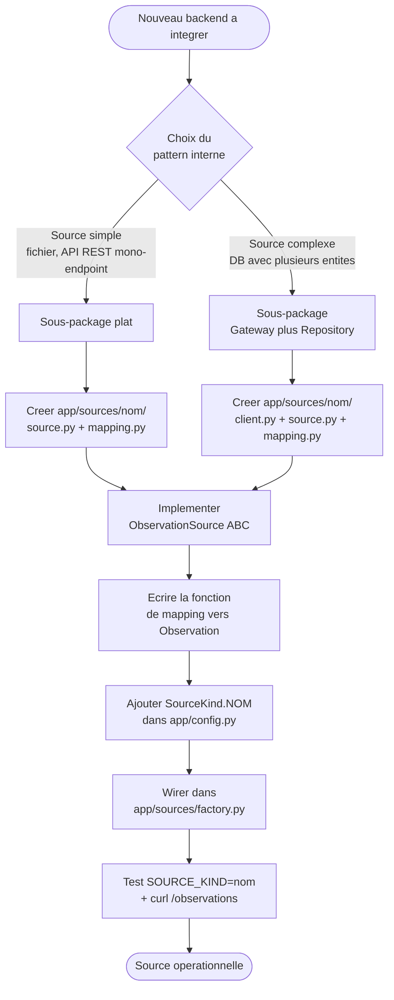

# Ajouter une nouvelle source

Ce document explique comment brancher un nouveau backend de donnees (autre API, autre database, fichier different, etc.) sans toucher au contrat expose au frontend.

Prerequis : avoir lu [01-architecture.MD](./01-architecture.MD) (pattern hexagonal et regle de dependance) et [03-bigquery.MD](./03-bigquery.MD) (exemple de reference pour le pattern Gateway + Repository).

## Vue d'ensemble du process



## Etape 1 : choisir le pattern interne

Deux variantes selon la complexite du backend.

### Variante A : source simple

Pour la lecture d'un fichier, l'appel d'une API REST mono-endpoint, ou tout backend ne necessitant pas de partage de connection entre plusieurs ressources :

```
app/sources/<nom>/
  __init__.py
  source.py        L'adapter qui implements ObservationSource
  mapping.py       La fonction de mapping pure
```

Exemple de reference : `app/sources/mock_legacy/` qui ajoute en plus un `loader.py` (lecture fichier JSON unique au boot).

### Variante B : source complexe (Gateway + Repository)

Pour une database avec plusieurs entites a query, ou une source destinee a etre reutilisee par plusieurs ressources futures :

```
app/sources/<nom>/
  __init__.py
  client.py        Gateway generique (auth, connection, primitives async)
  source.py        Repository specialise (topologie, SQL, orchestration)
  mapping.py       Fonction de mapping pure
```

Exemple de reference : `app/sources/bigquery/` (voir [03-bigquery.MD](./03-bigquery.MD)).

## Etape 2 : implementer le port `ObservationSource`

L'interface a respecter (cf. `app/sources/base.py`) :

```python
class ObservationSource(ABC):
    @abstractmethod
    async def list_observations(
        self, filters: ObservationFilters
    ) -> tuple[list[Observation], int | None]:
        """Retourne (page_data, total_items_avant_pagination).

        Si filters.include_total est False, retourne None pour le total
        et evite la query COUNT cote source.
        """
        ...

    @abstractmethod
    async def health(self) -> dict:
        """Retourne au minimum {'source': str, 'ok': bool, ...}"""
        ...
```

Conventions a respecter :

- Les filtres `essai_id`, `date_min`, `date_max` sont optionnels (peuvent etre `None`)
- `limit` et `offset` doivent etre appliques par la source elle-meme
- En mode skip-count (`include_total=False`), eviter tout aller-retour supplementaire vers le backend pour le total
- Toute exception propre au backend (`google.api_core.exceptions.NotFound`, `FileNotFoundError`, `httpx.HTTPError`, etc.) doit etre wrappee en `SourceUnavailableError` avant d'etre levee

## Etape 3 : ecrire la fonction de mapping

Convention : une fonction pure isolee dans `<nom>/mapping.py`, sans aucune dependance I/O. Testable sans mock.

Exemple inspire de `mock_legacy/mapping.py` :

```python
def legacy_to_observation(record: dict) -> Observation:
    """Convertit un record du format source vers Observation.

    Leve LegacyParseError si record inexploitable.
    """
    try:
        return Observation(
            essai_id=_parse_essai_id(record["experimentCode"]),
            parcelle_id=_normalize_plot(record["plotName"]),
            date_observation=_unix_to_date(record["recordedAt"]),
            mesure_valeur=_parse_value(record.get("value")),
            mesure_type=_normalize_metric(record["metric"]),
        )
    except (KeyError, ValueError, TypeError) as e:
        raise LegacyParseError(f"Cannot map record: {e}") from e
```

Choix de design important : si un record est invalide, **leve une exception explicite** (`LegacyParseError` ou exception dediee). L'adapter principal decide ensuite de la strategie globale (skip + log warning, raise complet, etc.).

## Etape 4 : declarer dans `SourceKind`

Dans `app/config.py` :

```python
class SourceKind(str, Enum):
    IN_MEMORY = "in_memory"
    BIGQUERY = "bigquery"
    MOCK_LEGACY = "mock_legacy"
    NEW_SOURCE = "new_source"   # ajout
```

Si le backend necessite de nouveaux parametres d'environnement (URL, credentials path, token), ajouter les champs correspondants dans `Settings` du meme fichier. Toujours via env vars, jamais en dur.

## Etape 5 : wirer dans la factory

Dans `app/sources/factory.py` :

```python
from app.sources.new_source.source import NewObservationSource

def get_source(settings: Settings) -> ObservationSource:
    if settings.source_kind == SourceKind.IN_MEMORY:
        return InMemoryObservationSource()
    if settings.source_kind == SourceKind.BIGQUERY:
        client = BigQueryClient(settings)
        return BigQueryObservationSource(client)
    if settings.source_kind == SourceKind.MOCK_LEGACY:
        return MockLegacyObservationSource(settings)
    if settings.source_kind == SourceKind.NEW_SOURCE:
        return NewObservationSource(settings)
    raise NotImplementedError(...)
```

## Etape 6 : tester

```bash
# Dans .env
SOURCE_KIND=new_source

# Relancer
uvicorn app.main:app --reload --port 8000

# Tester l'endpoint, le contrat expose doit etre IDENTIQUE
curl "http://localhost:8000/observations?essai_id=IA&limit=5"
```

La reponse doit avoir **exactement** la meme forme que pour les autres sources : `ApiResponse[list[Observation]]` avec `status`, `message`, `data`, `size`, `pagination`, `error`. C'est la preuve que le contrat est stable (voir [02-api-contract.MD](./02-api-contract.MD)).

## Anti-patterns a eviter

| Anti-pattern                                                       | Pourquoi c'est mauvais                                                                  |
| ------------------------------------------------------------------ | --------------------------------------------------------------------------------------- |
| Mettre le SQL dans la config (env var `BQ_QUERY=...`)              | Inversion des responsabilites : la topologie est metier, pas environnementale           |
| Faire le mapping dans la route HTTP                                | Couplage : un changement de format source force a toucher la route                      |
| Lever l'exception SDK brute (`google.api_core.exceptions.NotFound`)| Fait fuiter la techno dans le domaine. Wrap dans `SourceUnavailableError`               |
| Ajouter un champ specifique a la source dans `Observation`         | Brise la stabilite du contrat. Toutes les sources doivent fournir les memes champs      |
| Mettre les credentials dans le code de la source                   | Toujours via `Settings` (env vars), jamais en dur                                       |
| Faire l'I/O dans `mapping.py`                                       | Le mapping doit rester pur pour etre testable sans mock                                 |

## Verification finale

Avant de declarer la source operationnelle, verifier :

- Le contrat de reponse est identique pour `SOURCE_KIND=new_source` et `SOURCE_KIND=bigquery` (meme structure JSON, memes champs)
- Le filtrage et la pagination fonctionnent (test avec `essai_id`, `date_min/max`, `limit/offset`)
- `/healthz` retourne `source.ok = true` quand la source est joignable
- Le mode `include_total=false` court-circuite bien la query COUNT (pas d'appel inutile au backend)
- Les erreurs (source down, record invalide) sont converties en `ApiResponse[None]` avec un code d'erreur structure
